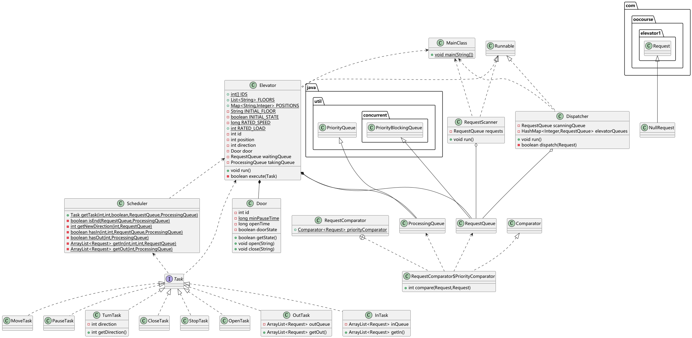
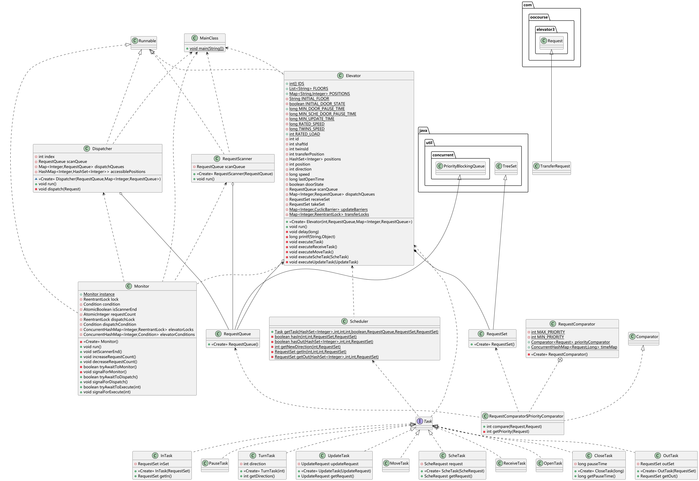
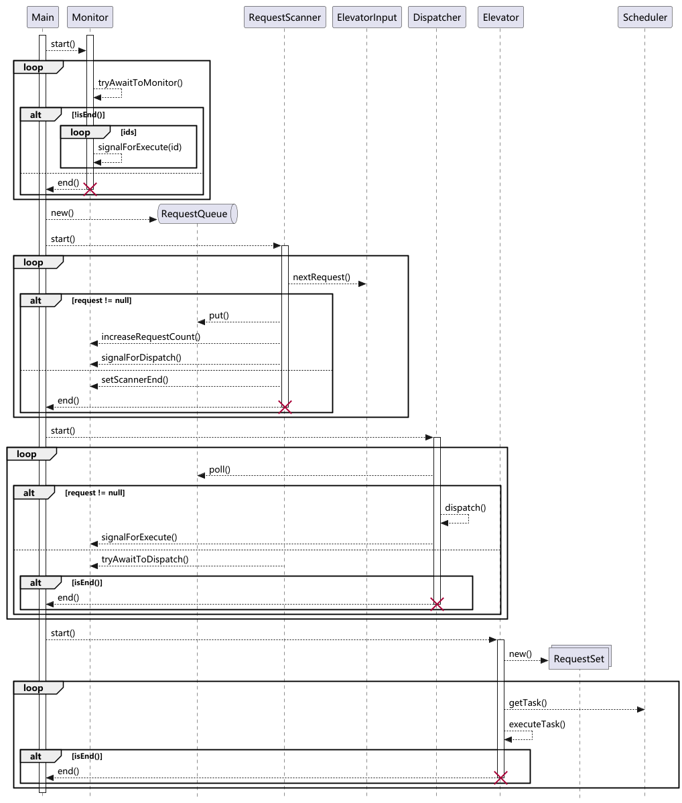

# BUAA-OO-2025-U2总结

## 一、同步互斥

由于同步块粒度过粗、功能有限，三次作业中，笔者从未使用`synchronized`关键字，而是借助Java标准库的`Atomic`类和`Concurrent`容器，结合`ReentrantLock`锁、`Condition`信号和`Barrier`屏障，实现同步互斥。

具体而言，使用`Atomic`类代替存在写相关的基本类型，使用`Concurrent`容器替代存在写相关的容器，使用`ReentrantLock`锁实现互斥/原子方法，使用`Condition`信号实现等待/唤醒机制，使用`Barrier`屏障实现同步机制。

三次作业中，均使用`PriorityBlockingQueue`构造公共请求队列。它天生适合生产者——消费者模式，又可以使用指定比较器方便地对请求排序。

第一次作业中，不存在共享请求队列之外的同步互斥需求，所有同步互斥需求都可以借助`BlockingQueue`实现。

第二次作业中，由于临时调度请求可能导致乘客重新分派，调度器和所有电梯需要在所有请求完成后才能退出，所以笔者使用`AtomicInteger`类记录请求数量，并将“查询——判断——等待/退出”操作和唤醒操作通过`ReentrantLock`锁实现为原子操作。

第三次作业中，由于双轿厢需要同步开始改造，且运行时两轿厢不得碰撞，笔者因此使用`Barrier`屏障保证同步改造，使用`ReentrantLock`锁保证互斥访问换乘楼层。

## 二、调度策略

三次作业中的调度器分为运行调度器和分派调度器。

对于运行调度器，笔者均采取 LOOK 算法，使用策略模式实现电梯运行。具体而言，电梯每次循环先调用运行调度器获取运行任务，然后根据任务类型执行任务。由于运行调度器类被设计为工具类，其所有方法都是静态方法，可供电梯线程任意调用，因此他们之间没有特殊交互关系。

对于分派调度器，除应直接分派的第一次作业外，笔者均采取均分算法，使用等待/唤醒机制实现请求分派。

对于输入线程和分派调度器线程，以及分派调度器线程和电梯线程这两组生产者——消费者：

第一次作业借助`BlockingQueue`类，结合“毒丸“对象，消费者循环调用其`take()`方法，队列为空时阻塞；生产者线程调用其`put()`方法，并唤醒阻塞的消费者。

后两次作业将分派调度器线程与其他线程之间的交互集中到`Monitor`类中。当队列为空时，消费者不再阻塞在队列中，而是在`Monitor`中等待；生产者进行生产后，唤醒所需唤醒的消费者。`Monitor`线程关注输入线程的结束情况和请求的完成情况，适时为各生产者和消费者设置结束标志并唤醒它们，不再需要”毒丸对象“。

LOOK 运行算法与均分分派算法结合，通过支持优先级的容器方便地选取优先级最高/紧急性最强的请求进行执行/分派，在优先级上最大化适应时间指标；通过同方向捎带、谨慎转向，以及避免过轻/过重负载，可一定程度上适应时间和电量指标。尽管使用模拟算法或图算法可以进一步优化这些指标，但由于并发制约，总的来说，这样的算法选择是合理的。

## 三、线程协同

由于调度问题的业务逻辑固定，三次作业的线程协同架构模式保持稳定，均为流水线架构模式。所含流水线基本可以简化为“输入器——分派器——运行器（电梯）”。

由于请求的类型不同，三次作业关于处理不同类型请求的逻辑易变。扩展请求类型需要在`PriorityComparator`类中指定优先级，通过`Task`接口实现类在`Scheduler`类和`Elevator`类中实现请求逻辑，必要时在`Monitor`类中实现新的等待/唤醒机制。

### （一）UML 类图

#### 1. 第一次作业

#### 2. 第二次作业

电梯私有请求容器的父类由`PriorityQueue`改为`Treeset`，以支持有序遍历。

等待/唤醒机制集中实现到`Monitor`类中，便于实现退出判断。

展平`Door`类，移除”毒丸“类，简化代码逻辑。

#### 3. 第三次作业

新增换乘请求，用于双轿厢电梯关于换乘楼层的通信。

### （二）UML 协作图

## 四、双轿厢问题

第三次作业中，笔者通过`Barrier`类实现双轿厢的同步开始改造，通过`ReentrantLock`锁实现运行时两个轿厢不碰撞。

具体而言，电梯类拥有静态`Barrier`容器和静态`ReentrantLock`容器。在`BEGIN`和`END`输出前后通过`id`为无需更换电梯井电梯`id`的`Barrier`进行同步，在进入换乘楼层前获取`id`为无需更换电梯井电梯`id`的`ReentrantLock`，在离开换乘楼层后释放`id`为无需更换电梯井电梯`id`的`ReentrantLock`，必要时通过代分派`TransferRequest`的方式唤醒另一轿厢电梯离开换乘楼层。

## 五、Bug 与 Debug

三次作业中，笔者的程序曾出现过无数Bug，绝大多数是对晦涩的题目要求理解不透彻导致的。如关于临时调度请求和双轿厢改造请求需要重新分派乘客的范围和时机，笔者迭代时反复遗忘题目细节，共将其理解为三四种情况，不断造成回归问题。

此外，反复修复回归问题的心情烦躁，导致笔者在加减号、上下梯和进出队列等方面混淆不断，又造成了剩余多半的Bug。

最终值得一提的Bug是一个有关线程同步互斥的Bug。在笔者的程序中，分派器线程和电梯线程存在相互唤醒关系，且在进入等待前需要检查结束条件，根据结束条件选择阻塞等待或者完工退出。然而，笔者在使用`AtomicInteger`类实现结束条件变量后以为万事大吉，实则忘记了线程安全不止要求原子性，未将查询、判断、等待/退出和唤醒操作的互斥关系理清，导致可能出现“线程1查询到无法结束——线程2设置了结束条件——线程2唤醒需要结束的线程——线程1进入阻塞等待状态”的情况。这个Bug虽然将笔者暂时蒙蔽，但解决起来比较简单，扩大同步控制范围即可。

多线程程序Debug比较困难，一是调试方式不像单线程程序那样简单直观；二是错误难以像单线程程序那样稳定复现。具体而言，多线程程序Debug因为无法实现`JVM`的单步运行，不能仅依赖断点调试，需要在一定程度上回归打印关键变量的方式，且需要大量负载较高的测试。在这种情况下，一个支持多进程、日志分辨的评测机就显得尤为重要。

## 六、心得体会

实践问题的出现根本上是由于理论问题未解决，三次作业后，笔者回顾理论课上 PPT ，对线程安全有了更为深刻的认识。

使用线程安全类不能完全避免显式同步块和锁的使用，多个线程安全对象如果又形成了“Read-Modify-Write”或“Check-Then-Act”关系，依然可能产生线程安全问题，需要适当扩大同步控制范围。

层次化设计需要合适的继承、封装、多态关系，善用标准库可以起到事半功倍的作用。这需要充分了解语言特性，熟练掌握标准库，不能一知半解，否则会给自己带来更大的麻烦。

